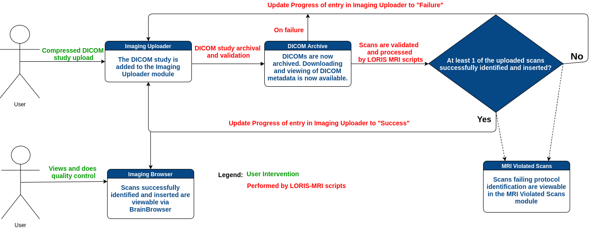

# 1.0 - Introduction

### 1.1 What is LORIS-MRI?  LORIS-MRI is the backbone of the imaging
component that makes up LORIS.
 It is maintained in a separate repository so that it can be installed
 on the file server and separated from the web server.
These documents assume you have some knowledge regarding LORIS and
a functioning installation. For information regarding LORIS itself,
please consult the [LORIS wiki][1].

LORIS-MRI is a set of libraries responsible for the insertion,
visualization and archival of uploaded imaging datasets.
 It expects an uploaded, compressed file containing
several [DICOM][2] files, converts this into [MINC][3] and [NII][4]
files, and then archives these files onto the server. Knowledge of
these file formats can be helpful, but are not necessary for using or
installing LORIS-MRI.

LORIS-MRI allows you to easily organize and archive your imaging datasets
and links them with
 corresponding behavioral data in LORIS. Scans can be viewed and quality
 controlled through the user's web browser, facilitating collaboration
 between radiologists, clinicians and researchers.

### 1.2 How does LORIS-MRI work?  
LORIS-MRI allows multiple ways to upload scans, more details about these
options can be found [here.](05-PipelineLaunchOptions.md) First, users
upload a compressed (.tgz, .tar.gz, or .zip) DICOM folder to Imaging
Uploader.  LORIS requires that the uploaded file name follow the naming
convention PSCID_CANDID_VISIT-LABEL.  Assuming the upload went through
successfully, an entry is added to the menu of Imaging Uploader and the
upload's status throughout the pipeline can then be tracked by the user
through the Log Viewer.

All DICOM datasets transferred to the DCC must be free of any identifying
information (e.g. patient name). A tool can be provided to the sites to
facilitate deidentification. Please contact the LORIS team for details.

The LORIS-MRI pipeline starts once the scans are uploaded to the server.
The pipeline can start automatically if the autolaunch configuration is
set, otherwise
 manual intervention is required by a developer with backend access to
 the server (information on the scripts needed to run the pipeline can
 be found in the [Scripts section](04-Scripts.md) of the documentation).

 First, the upload is prepped to be archived on the server. The
 PatientName in the
  DICOM headers is validated by the LORIS database and the upload is
  checked to ensure that only DICOM files were uploaded.  Given that
 all uploaded metadata is valid, the DICOM upload is archived on the
 server.

 Following archival, the scans are converted into MINC and (optionally)
 NII file formats. At this stage, scan parameters such as echo time,
 repetition time, etc., are checked with the MRI protocol table in the
 LORIS database to determine the scan types.

Before running the DICOM archival and MINC insertion stages, the
uploaded imaging dataset will be validated to make sure that the study
has not been fully inserted yet, that there are indeed DICOM files in the
uploaded compressed file and that the patient name stored in the DICOM
files matches the one entered when uploading the imaging dataset. If
the uploaded compressed imaging dataset has not be validated, then DICOM
archival and MINC insertion stages will not be run on this dataset and a
log message will be available in the Log Viewer of the Imaging Uploader
module.  However, if all went well during the first validation of the
uploaded compressed file, then the DICOM archival and MINC insertion
stages will be run. During the MINC insertion stage, if the scan type
of a MINC image could not be determined using the mri_protocol table,
then the scan will be inserted into the MRI violations LORIS module
where details of the faulty scan can be viewed. If at least one scan
successfully passed through the pipeline, the Progress column in the
Imaging Uploader is set to success and successfully inserted scans are
viewable in the Imaging Browser module. Each scan is then available
to be navigated in BrainBrowser in 3D or 4D space. More details on the
capabilities of BrainBrowser can be found [here.][5]

[1]: https://github.com/aces/Loris/wiki 
[2]: http://dicomiseasy.blogspot.ca/2011/10/introduction-to-dicom-chapter-1.html
[3]: https://en.wikibooks.org/wiki/MINC/Introduction 
[4]: https://nifti.nimh.nih.gov/ 
[5]: https://brainbrowser.cbrain.mcgill.ca/
